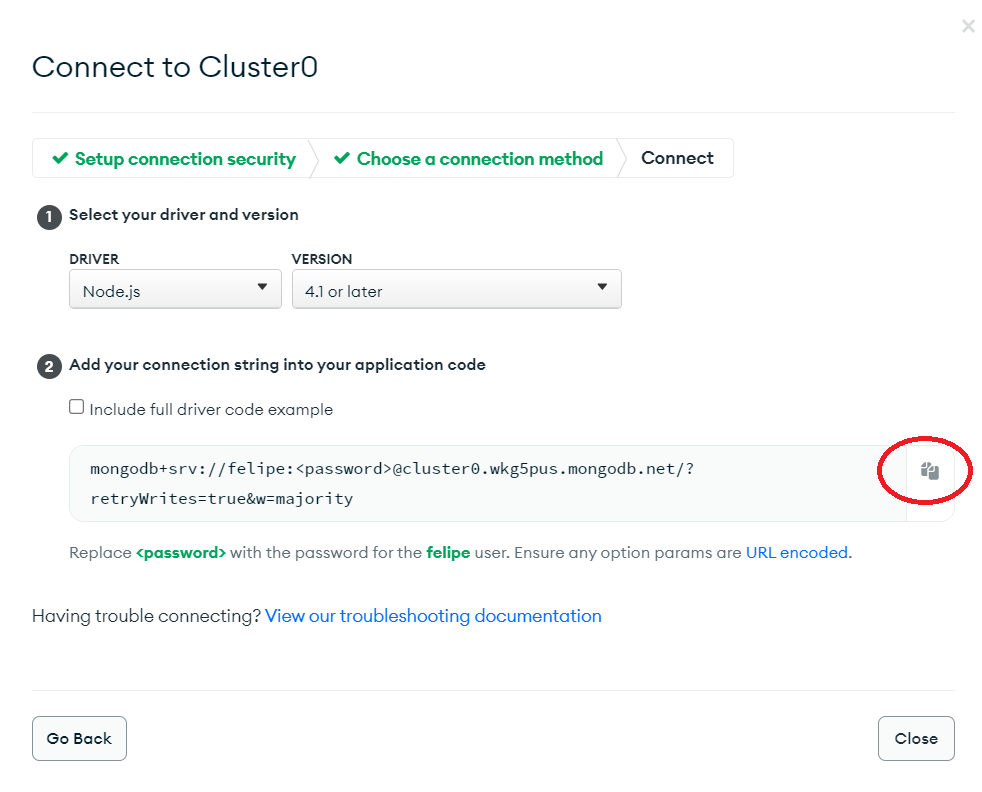

<h1 align="center">Welcome to Planner 👋</h1>

> This planner will help the client to organize his week, his tasks and at what times they happen.

### 🏠 [API Link](https://compass-planner.herokuapp.com/api/v1/events)

## Install

Make sure to have Git, Node.js and npm installed and use your terminal to follow the steps below:

```sh
git clone https://github.com/febomtempo/compass-planner.git
cd compass-planner/
npm install
```

## Getting Started

First you will need to create a MongoDB Atlas Cluster following this 9 steps:

<table><tr>
<td>  </td>
<td>  </td>
<td>  </td>

</tr></table>
<table><tr>
<td>  </td>
<td>  </td>
<td>  </td>

</tr></table>
<table><tr>
<td>  </td>
<td>  </td>
<td>  </td>

</tr></table>

```bash
  1 - Go to https://www.mongodb.com/cloud/atlas/register to register and sign in.
  2 - After Sign in, select the last option to create a Free Database.
  3 - Select the Free (Shared Option) and click "Create Cluster".
  4 - Create a User setting up an username and password (don't forget to save this password)
  5 - Add a new entry to IP Access List (0.0.0.0/0), then cl.ick "Finish and Close".
  6 - After the last step, click "Connect".
  7 - Click "Connect you application".
  8 - Copy the connection string.
  9 - Create a .env file and set up like ".env.example", don't forget to change "<password>" with the password you created before.
```

## Usage

Now just run the code below:

```sh
npm run start:dev
```

## API Documentation

## GET Routes

#### Return all Events

```http
  GET /api/v1/events
```

#### Return a specific Event

```http
  GET /api/v1/events/{id}
```

| Parameter | Type     | Description                            |
| :-------- | :------- | :------------------------------------- |
| `id`      | `string` | **Required**. Event ID you want to get |

#### Return all Event(s) by the day of the week

```http
  GET /api/v1/events?dayOfTheWeek=0
```

| Parameter                | Type     | Description                                                                                                                   |
| :----------------------- | :------- | :---------------------------------------------------------------------------------------------------------------------------- |
| `day of the week (0-6) ` | `number` | **Required**. Starting on 0 (Sunday) to 6 (Saturday), it will return all events where dateTime is on the same day of the week |

## POST Routes

#### User Sign Up

```http
  POST /api/v1/users/signUp
```

| Parameter         | Type     | Description                    |
| :---------------- | :------- | :----------------------------- |
| `firstName`       | `string` | **Required**. First Name       |
| `lastName`        | `string` | **Required**. Last Name        |
| `birthDate`       | `Date`   | **Required**. Birth Date       |
| `city`            | `string` | **Required**. City             |
| `country`         | `string` | **Required**. Country          |
| `email`           | `string` | **Required**. E-mail           |
| `password`        | `string` | **Required**. Password         |
| `confirmPassword` | `string` | **Required**. Confirm Password |

#### User Sign In

```http
  POST /api/v1/users/signIn
```

| Parameter  | Type     | Description            |
| :--------- | :------- | :--------------------- |
| `email`    | `string` | **Required**. E-mail   |
| `password` | `string` | **Required**. Password |

#### Create Event

```http
  POST /api/v1/events/
```

| Parameter     | Type     | Description                                                         |
| :------------ | :------- | :------------------------------------------------------------------ |
| `description` | `string` | **Required**. Event Description                                     |
| `dateTime`    | `Date`   | **Required**. Event DateTime - Example : '2023-02-12T22:03:47.262Z' |

## DELETE Routes

#### Delete a specific Event

```http
  DELETE /api/v1/events/{id}
```

| Parameter | Type     | Description                               |
| :-------- | :------- | :---------------------------------------- |
| `id`      | `string` | **Required**. Event ID you want to delete |

#### Delete all Event(s) by the day of the week

```http
  DELETE /api/v1/events?dayOfTheWeek=0
```

| Parameter                | Type     | Description                                                                                                                   |
| :----------------------- | :------- | :---------------------------------------------------------------------------------------------------------------------------- |
| `day of the week (0-6) ` | `number` | **Required**. Starting on 0 (Sunday) to 6 (Saturday), it will delete all events where dateTime is on the same day of the week |

## Author

👤 **Felipe**

- Github: [@febomtempo](https://github.com/febomtempo)
- LinkedIn: [@https:\/\/www.linkedin.com\/in\/felipe-bomtempo\/](https://linkedin.com/in/https://www.linkedin.com/in/felipe-bomtempo/)

---
